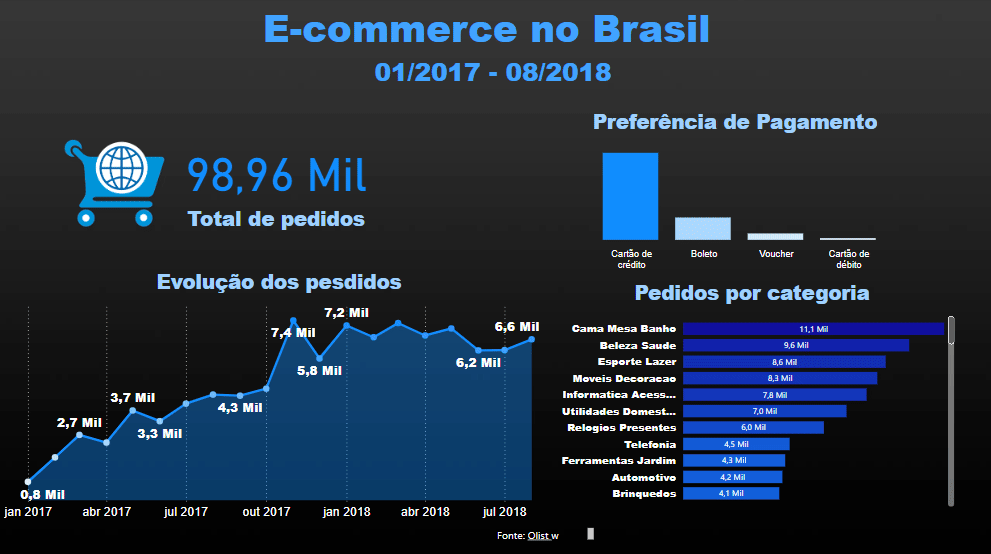

# Projeto Dashboard E-commerce

Este projeto foi desenvolvido durante a formação Power BI na Alura, no curso "Power BI Desktop: tratamento de dados no Power Query". O objetivo principal foi explorar o tratamento de dados no Power BI Desktop, utilizando datasets em diferentes formatos (.xls, .csv, Google Sheets, pastas do Excel, entre outros) e o Power Query para limpeza e manipulação de dados.
Os dados utilizados foram obtidos a partir de um dataset da Olist, fornecido pelo Kaggle. Após o tratamento no Power Query, o projeto finaliza com a criação de um dashboard interativo, destacando os principais insights sobre pedidos de um e-commerce

### :computer: Projeto
O projeto consiste na construção de um dash de dados para um e-commerce, explorando a evolução dos pedidos entre 2017 e 2018, as principais categorias de produtos e as preferências de formas de pagamento. O foco foi a prática de funções do Power Query para tratamento de dados.

### :pushpin: Funcionalidades do projeto
- Total de Pedidos: O dashboard exibe o total de 98,96 mil pedidos realizados entre janeiro de 2017 e agosto de 2018.
- Evolução dos Pedidos: Um gráfico de linha mostra a evolução dos pedidos ao longo do tempo, com picos em outubro de 2017 (7,4 mil pedidos) e janeiro de 2018 (7,2 mil pedidos).
- Preferência de Pagamento: Um gráfico de barras mostra que a maior parte das compras foi feita com cartão de crédito, seguido de boleto, voucher e cartão de débito.
- Pedidos por Categoria: Um gráfico de barras exibe as principais categorias de produtos, com destaque para Cama Mesa Banho (11,1 mil pedidos), seguida por Beleza e Saúde (9,6 mil pedidos) e Esporte e Lazer (8,6 mil pedidos).

### :hammer: Tecnologias utilizadas
- `Power BI`
- `Excel`
- `Kaggle (dataset Olist)`

### :open_file_folder: Como abrir e rodar o projeto
1.	Faça o download das bases de dados e do arquivo .pbix.
2.	Abra o Power BI e carregue o arquivo .pbix na mesma pasta onde os datasets estão salvos.
3.	O projeto estará pronto para ser visualizado e avaliado.

### :bulb: Contato
Se este projeto te ajudou, não esquece de me seguir! ✨ Fico super feliz em receber sugestões de melhorias ou dicas para continuar evoluindo! Pode me chamar no Linkedin ou mandar um e-mail, vou adorar conversar com você! 😊📩
- Email: rlarissa191@gmail.com
- Linkedin: https://www.linkedin.com/in/larissa-de-almeida-ribeiro-212214197/
